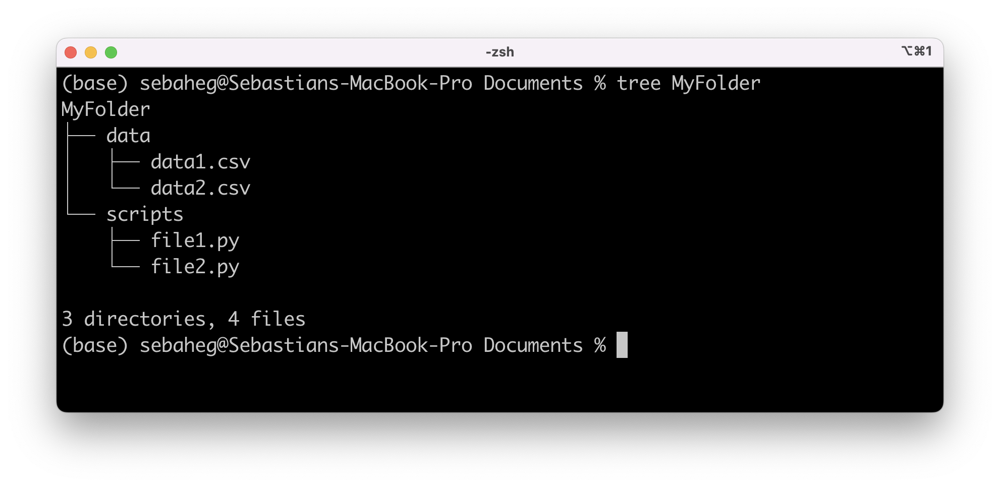

# Data Science Tips and Tricks 📈

This page contains a collection of small, helpful Python tricks and tips designed to streamline your Python workflow, improve your productivity, and help you write smarter code. 

## 📖 Table of Contents

- [Warning when pip install in base](#warning-when-pip-install-in-base)
- [Print folder tree structure in terminal](#print-folder-tree-structure-in-terminal)
---

## 💡 Tips and Hacks

### Warning when pip install in base
Add this script to your shell configuration file, e.g. `~/.bashrc` or `~/.zshrc`. To check which shell you are using run `echo $SHELL`.

```bash
pip() {
    if [[ -z "$VIRTUAL_ENV" ]]; then
        echo "WARNING: You are not in a virtual environment. Do you want to proceed? (yes/no)"
        read -r answer
        if [[ "$answer" != "yes" ]]; then
            echo "Aborting pip command."
            return 1
        fi
    fi
    command pip "$@"
}
```

### Print folder tree structure in terminal
The terminal command `tree` lets you list the contents of a folder as a tree-like structure. The command to run is `tree path/to/folder`. 



Instructions to install `tree`on Linux or MacOS (already pre-installed on Windows): 

```
sudo apt-get install tree # On Linux
brew install tree # On MacOS (with homebrew)
```

---

Happy hacking! 💻
